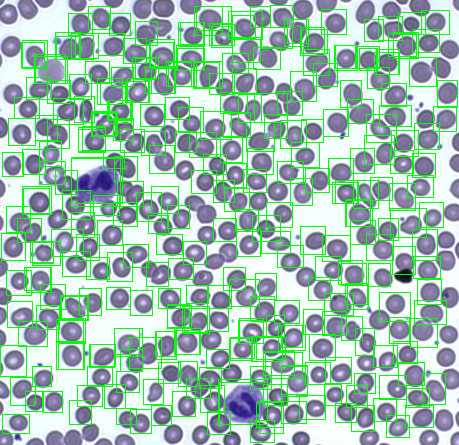
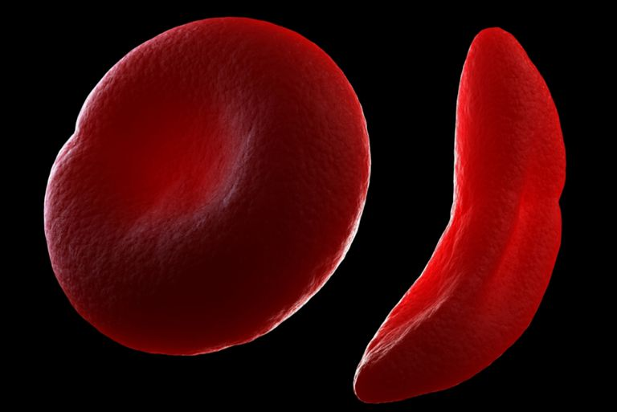
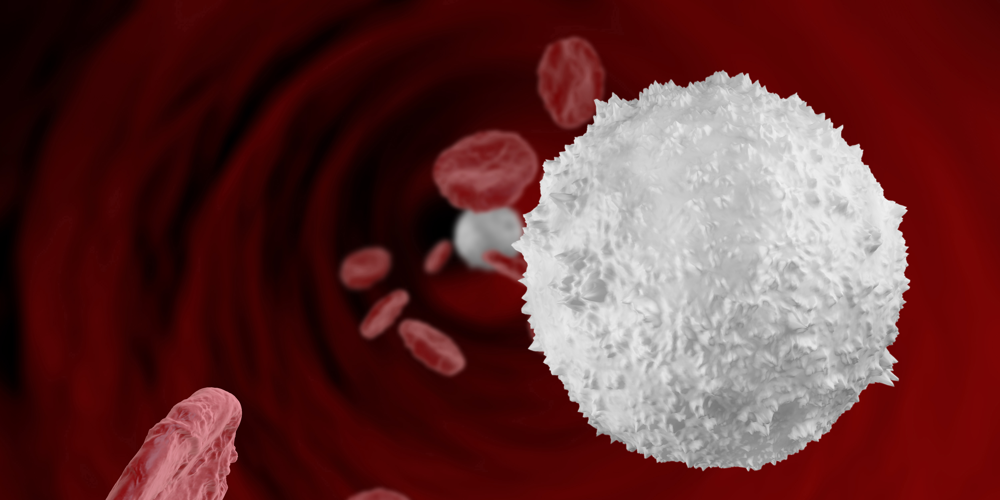

-------------------------------------------------------------------------------------

Repository for Pytorch Implementation of Cell Network 2018
MICCAI-2018

You can see the paper [here]()

## Differential Blood Cell Count, Why is it important?

A complete blood count(CBC) is a test that measures the cells that make up your blood: red blood cells, white blood cells, and platelets.

Out of the 3 tests, in this paper we mainly focus on the RBC cell count and WBC cell count. Details and specifics of each will be described below.

### Red Blood Cell Count

A red blood cell count(also known as the erythrocyte count) is a blood test to find out how many red blood cells(RBCs) you have.

It is important because RBCs contain hemoglobin, which carries oxygen to your body's tissues. The number of RBCs you have can affect how much oxygen your tissues receive. 

Having higher number of RBCs might indicate symptoms such as polycythemia, while decreased number of RBCs can lead to diagnosis of anemia.

### White Blood Cell Count

A white blood cell count(also known as the leukocyte count) is a test that measures the number of white blood cells in your body. There are several types of white blood cells, and your blood usually contains a percentage of each type.

WBCs are an important part of the immune system. These cells help fight infections by attacking bacteria, viruses, and germs that invade the body.
White blood cells originate in the bone marrow but circulate throughout the bloodstream.

Having a higher or lower number of WBCs than normal may be an indication of an underlying condition. A WBC count can detect hidden infections within your body and alert doctors to undiagnosed medical conditions, such as autoimmune diseases, immune deficiencies, and blood disorders.

This test also helps doctor monitor the effectiveness of chemotheraphy or radiation treatment in people with cancer.

## Previous works of Blood Cell Counting.
[TD] Research of papers for previous studies or repository for previous blood cell classification modules.

## CellNet, Full Pipeline cell detection counter
[TD] Description for the cell detection counter model.

## Modules
- [#1 Preprocessor](./1_preprocessor)
- [#2 Parser](./2_parser)
- [#3 Detector](./3_detector)
- [#4 Classifier](./4_classifier)
