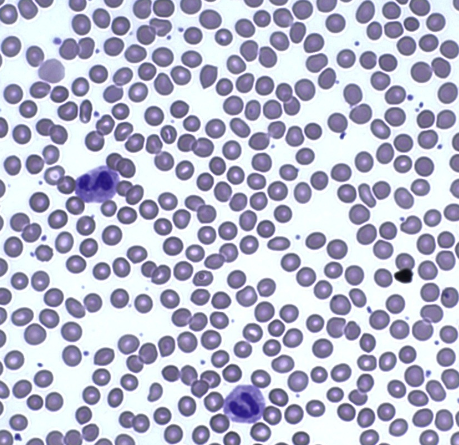
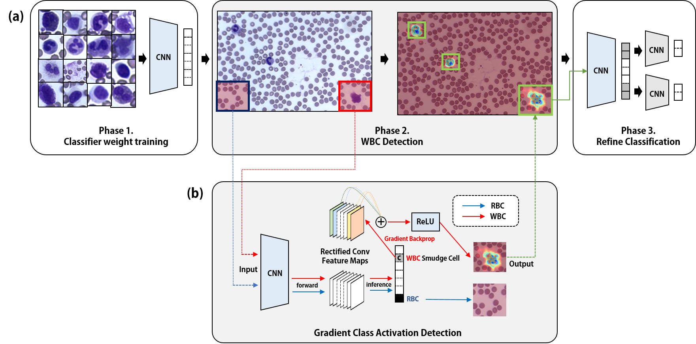

<p align="center"></p>

-------------------------------------------------------------------------------------

This is the repository for Pytorch Implementation of the
MICCAI-2018 paper, "Hierarchy Attentive Luekocyte Detection without Location Annotation".
If you have any issues regarding this repository or the paper, please contact meliketoy@gmail.com.

Authors
- Bumsoo Kim
- Junhyun Lee
- Hyunjoo Choi
- Hwejin Jung
- Chaeseung Lim
- Jaewoo Kang

You can see the paper [here]().

## Modules
- [#1 Preprocessor](./1_preprocessor)
- [#2 Parser](./2_parser)
- [#3 Classifier](./3_classifier)
- [#4 Detector](./4_detector)
- [#6 Baseline](./6_baseline)

## Requirements
See the [installation instruction](INSTALL.md) for a step-by-step installation guide.
See the [server instruction](SERVER.md) for server settup.
- Install [cuda-8.0](https://developer.nvidia.com/cuda-downloads)
- Install [cudnn v5.1](https://developer.nvidia.com/cudnn)
- Download [Pytorch for python-2.7](https://pytorch.org) and clone the repository.
- Enjoy!

```bash
pip install http://download.pytorch.org/whl/cu80/torch-0.1.12.post2-cp27-none-linux_x86_64.whl
pip install torchvision
git clone https://github.com/meliketoy/cellnet.pytorch
```

## Differential Blood Cell Count, Why is it important?


A complete blood count(CBC) is a test that measures the cells that make up your blood: red blood cells, white blood cells, and platelets.

Out of the 3 tests, in this paper we mainly focus on the WBC cell count. Details and specifics of each will be described below.

### Red Blood Cell Count
[FUTURE WORKS]

A red blood cell count(also known as the erythrocyte count) is a blood test to find out how many red blood cells(RBCs) you have.

It is important because RBCs contain hemoglobin, which carries oxygen to your body's tissues. The number of RBCs you have can affect how much oxygen your tissues receive. 

Having higher number of RBCs might indicate symptoms such as polycythemia, while decreased number of RBCs can lead to diagnosis of anemia.

### White Blood Cell Count


A white blood cell count(also known as the leukocyte count) is a test that measures the number of white blood cells in your body. There are several types of white blood cells, and your blood usually contains a percentage of each type.

WBCs are an important part of the immune system. These cells help fight infections by attacking bacteria, viruses, and germs that invade the body.
White blood cells originate in the bone marrow but circulate throughout the bloodstream.

Having a higher or lower number of WBCs than normal may be an indication of an underlying condition. A WBC count can detect hidden infections within your body and alert doctors to undiagnosed medical conditions, such as autoimmune diseases, immune deficiencies, and blood disorders.

This test also helps doctor monitor the effectiveness of chemotheraphy or radiation treatment in people with cancer.

## Previous works of Blood Cell Counting.
- [Automatic detection and classification of leukocytes using convolutional neural networks](https://link.springer.com/article/10.1007/s11517-016-1590-x)

## White Blood Cell Detections

For the detection of white blood cells without location annotations, we first need to train a CNN model on patch cell images. The images will be trained on 9 classes(Monocytes; Eosinophils; Basophils; Lymphocytes; Atypical Lymphocytes; Neutrophil Bands; Neutrophil Segmented; RBCs). The detection is consisted of 3 phases.



### STEP 1 : Data preperation
You can prepare your data with the [preprocessing module](./1_preprocessor).
In the [configuration file](./1_preprocessor/config.py), set the directory to the full image patch data.
The patch blood cell data can be downloaded through [this link]().

```bash
$ cd ./1_preprocessor
$ python main

> Enter mode name : split # This will make a train-validation split in your 'split_dir' in config.py
> Enter mode name : check # This will print out the distribution of your split.
> Enter mode name : meanstd # This will print out the meanstd value of your train set.
```

Copy the value of meanstd in the third line, and paste it in the configurations of each [module 3](./3_classifier/config.py) and [module 4](./4_detector/config.py). View the [README-preprocessor](./1_preprocessor/README.md) for further instructions.

### STEP 2 : Classification
Then, in the [classifier module](./3_classifier), run the line below
```bash
$ ./scripts/train/resnet
```

This will fine-tune a pre-trained resnet-50 model on your blood cell dataset.
To train your network on different models & layers, view the [scripts](./3_classifier/scripts). See [README-classifier](./3_classifier/README.md) for further instructions.

### STEP 3 : Detection
After you have trained your model, there will be a model saved in the [checkpoint directory](./3_classifier/checkpoints).
The files in directory will be automatically updated in the detector module, searched by the directory name of your training set.

In the [configuration of module 4](./4_detector/config.py), match the 'name' variable identical to the 'name' you used in your classification training data directory name.

The heatmap generation for each of the test data can be done by running,
```bash
./scripts/detect.sh
```

This will generate a heatmap which will look like


See [README-detector](./4_detector/README.md) for further instructions.
